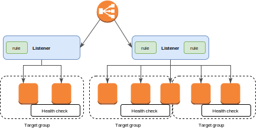

#What Is an Application Load Balancer?
Elastic Load Balancing は２つのタイプをサポートしている。Application load BalancersとClassic Load Balancers。このガイドはALBについて記述する。より詳細な情報については[Classic Load Balancer Guide](http://docs.aws.amazon.com/elasticloadbalancing/latest/classic/)

##Application Load Balancer Overview
ALBはOSI(Open Systems Interconnection)モデルの第7レイヤー、アプリケーションレイヤーで機能する。ロードバランサーはアプリケーションのHTTP通信のトラフィックの内容からルーティング分岐を作る。

ロードバランサーはマルチAZにある複数のEC2インスタンスをターゲットにアプリケーションへのトラフィックを振り分ける。これによってアプリケーションの障害耐性(フォルトトレランス)があがる。ELBはunhealthyのターゲットを検出し、healthyのターゲットだけにトラフィックを転送する。

ロードバランサーサーバは唯一のクライアントのための接続となる。これはアプリケーションの可用性を上げる。アプリケーション全体の流れを止めることなく、必要に応じてターゲットをロードバランサーから追加や削除ができる。ELBはアプリケーションにトラフィックが流れている間に時間をかけて徐々に拡張する。ELBは自動的に圧倒的なワークロードに拡張出来る。

health checkを設定することで、登録されたターゲットだけにリクエストを送る事ができる。

より詳細の情報は[How Elastic Load Blancing Works](http://docs.aws.amazon.com/elasticloadbalancing/latest/userguide/how-elastic-load-balancing-works.html)を参照

##Components
ロードバランサーサーバはクライアントと接続する唯一のポイント。listenersを一つ以上追加することが出来る。

listenerは指定したルールに従って、設定したプロトコルやポートからユーザのリクエストコネクションをチェックし、一つ以上のターゲットグループにリクエストを転送する。各ルールはターゲットグループ、条件と優先順位を指定する。条件が一致するとトラフィックはそのターゲットグループに転送される。各listenerはdefaultルールを定義しなければいけない。そしてリクエストの内容に合わせて違うターゲットグループを指定できる。(content-based routing)

それぞれのターゲットグループは指定したプロトコルとポート番号使ったEC2インスタンスをターゲットとして登録する必要がある。一つのターゲットを複数のターゲットグループに登録することが出来る。ターゲットグループ毎にhealth checkを設定できる。health checkはLBのlistenerに指定したターゲットグループに登録されたすべてのターゲットに対してい行われる。

下記の図は基本的な構成を示している。注意：各listenerはdefaultのルールが含まれている。一つのlistenerは違うターゲットグループに伝送する別のルールを含む。一つのターゲットは２つのターゲットグループに登録されている。

より詳細の情報は下記のドキュメントを参照

* Load Balancers
* Listeners
* Target Groups

##Benefits
Classic Load Balancerの代わりのApplication Load Balancerを使うと以下のベネフィットがある
* path-baseのルーティングをサポートしている。リクエストの中にあるURLをベースにリクエストを転送するlistenerのルールを設定できる。URLの内容に基いて正しいサービスにリクエストを転送し、よりサービスを小さく構築することが出来る。
* 複数のポートを使用して登録された一つのEC2インスタンスに複数のサービスを転送する事ができる。
* コンテナアプリケーションをサポートしている。ECSはタスクの登録やスケジュールをターゲットグループに行う時に未使用のポートを選択できる。これはクラスタを効率よく使うことが出来る。
* それぞれの独立したサービスのモニターリングをサポートしている。ターゲットグループレベルで定義したhealth checkとターゲットグループレベルでの沢山のCloudWatchメトリクスのレポート。ターゲットグループをAuto Scaling groupに追加することで必要に応じて動的に各サービスの拡張をすることが出来る。
* 追加情報を含んだアクセスログは圧縮されたフォーマとで保存される。
* ロードバランサーのパフォーマンスが改善された。

より詳しい情報は[Features of Elastic Load Balancing](http://docs.aws.amazon.com/elasticloadbalancing/latest/userguide/what-is-load-balancing.html#elb-features)

##How to Get Started
下記のtutorialの一つを試し、ALBを作成してみよう

* [Getting Started with Elastic Load Balancing](http://docs.aws.amazon.com/elasticloadbalancing/latest/userguide/load-balancer-getting-started.html) ELBユーザガイドにある
* [Tutorial: Use Path-Based Routing with Your Application Load Balancer](http://docs.aws.amazon.com/elasticloadbalancing/latest/application/tutorial-load-balancer-routing.html)
* [Tutorial: Use ECS Containers as Targets for Your Application Load Balancer](http://docs.aws.amazon.com/elasticloadbalancing/latest/application/tutorial-target-ecs-containers.html)